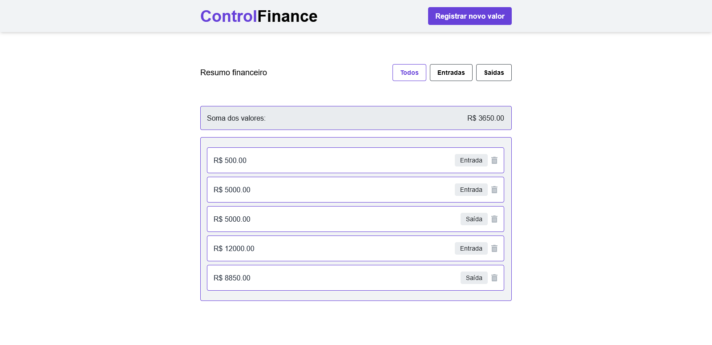
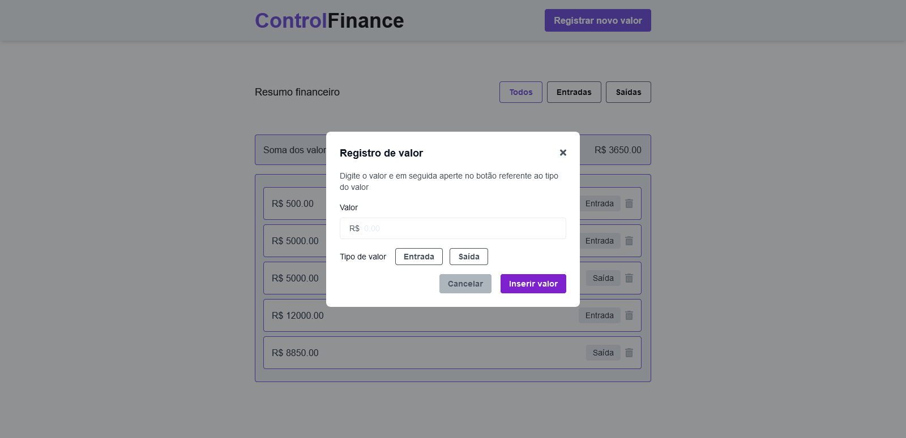

# Control Finance

[](https://github.com/JrValerio/Control-Finance-React-TailWind/actions/workflows/ci.yml)
[](LICENSE)

Aplicacao web para controle financeiro pessoal com entradas/saidas, filtros por categoria e periodo, grafico de receita x despesa, exportacao CSV e autenticacao JWT.

## Links

- Producao (Vercel): [control-finance-react-tail-wind.vercel.app](https://control-finance-react-tail-wind.vercel.app/)
- CI: [GitHub Actions - CI](https://github.com/JrValerio/Control-Finance-React-TailWind/actions/workflows/ci.yml)
- Releases: [GitHub Releases](https://github.com/JrValerio/Control-Finance-React-TailWind/releases)

## Deploy (Render + Vercel)

- Guia monorepo: `docs/deployment/monorepo-render-vercel.md`

## Preview




## Monorepo (v1.3.0 Foundation)

```text
apps/
  web/ -> Frontend React + Vite
  api/ -> Backend Express (healthcheck + base para auth/transactions)
```

Detalhes tecnicos:
- Foundation: `docs/architecture/v1.3.0.md`
- Auth: `docs/architecture/v1.3.0-auth.md`
- Transactions API: `docs/architecture/v1.3.1-transactions.md`
- Postgres Persistence: `docs/architecture/v1.4.0-postgres.md`
- Auth Hardening: `docs/architecture/v1.4.2-auth-hardening.md`
- Transactions CRUD+: `docs/architecture/v1.4.3-transactions-crud-plus.md`
- Export CSV: `docs/architecture/v1.5.0-export-csv.md`
- Web Pagination: `docs/architecture/v1.6.2-web-pagination.md`
- Pagination UI Polish: `docs/architecture/v1.6.3-pagination-polish.md`

## Funcionalidades atuais (web)

- Cadastro de transacoes com tipo (`Entrada` e `Saida`) e data
- Filtro por categoria: `Todos`, `Entrada`, `Saida`
- Filtro por periodo: `Todo periodo`, `Hoje`, `Ultimos 7 dias`, `Ultimos 30 dias`, `Personalizado`
- Saldo e totais por tipo em tempo real
- Grafico de receita x despesa (Recharts, lazy-loaded)
- Transacoes carregadas e persistidas pela API (por usuario autenticado)
- Modal com fechamento por `ESC` e clique no backdrop
- Remocao de transacoes
- Login e criacao de conta com JWT
- Sessao JWT com token em `localStorage` (chave namespaced)
- Logout e rota protegida para `/app`
- Protecao de login com rate limiting e bloqueio temporario por `IP+email`
- Edicao de transacao com descricao e observacoes
- Exclusao com confirmacao e desfazer (undo real)
- Exportacao CSV com filtros ativos (categoria + periodo) e totais consolidados
- Listagem paginada com `Anterior/Proxima` e indicador de pagina
- Faixa de pagina (`Mostrando X-Y de N`) e seletor de itens por pagina

## API (apps/api)

- `GET /health` retorna `{ ok: true, version }` com a versao atual do `apps/api/package.json`
- `POST /auth/register` cria usuario no Postgres
- `POST /auth/login` retorna `{ token, user }`
- `/auth/login` aplica rate limit por IP e bloqueio temporario por brute force
- `GET /transactions` lista transacoes do usuario autenticado com filtros opcionais (`type`, `from`, `to`, `q`, `includeDeleted`, `page`, `limit`)
  - resposta paginada: `{ data, meta: { page, limit, total, totalPages } }`
- `POST /transactions` cria transacao para o usuario autenticado
- `PATCH /transactions/:id` atualiza transacao do usuario autenticado
- `DELETE /transactions/:id` aplica soft delete para o usuario autenticado
- `POST /transactions/:id/restore` restaura transacao removida
- `GET /transactions/export.csv` exporta CSV filtrado com totais de entradas, saidas e saldo
- Migrations SQL automaticas no startup (`src/db/migrations`)
- Middleware global de erro e fallback `404`

## Como rodar localmente

1. Instalar dependencias:

```bash
npm ci
```

2. Subir web + api juntos:

```bash
npm run dev
```

3. Endpoints locais:

- Web: `http://localhost:5173`
- API: `http://localhost:3001/health`

## Variaveis de ambiente

- Referencia geral: `.env.example`
- Web: `apps/web/.env.example`
- API: `apps/api/.env.example`
- Em deploy (Vercel), `VITE_API_URL` e obrigatoria e deve apontar para a URL publica da API
- Para Postgres gerenciado com SSL, configure `DB_SSL=true` na API
- Em deploy com proxy (Render), use `TRUST_PROXY=1` na API
- `CORS_ORIGIN` da API pode receber lista separada por virgula (local + dominios de deploy)
- Hardening de login: `AUTH_RATE_LIMIT_*` e `AUTH_BRUTE_FORCE_*`

## Scripts (root)

- `npm run dev` inicia `apps/web` e `apps/api`
- `npm run lint` roda lint nos dois apps
- `npm run test` roda testes dos dois apps
- `npm run build` builda web e valida build da api
- `npm run preview` sobe preview do web

## Scripts (api)

- `npm -w apps/api run db:migrate` aplica migrations do Postgres
- `npm -w apps/api run db:seed` executa seed minima (usuario demo + transacoes)

## Qualidade

- CI com jobs separados para web e api em `.github/workflows/ci.yml`
- Branch protection habilitada na `main`
- Runtime padronizado em Node `24.x`

## Roadmap

- [x] PR 2 (v1.3.0): autenticacao JWT + rotas protegidas
- [x] PR 3 (v1.3.0): transacoes por usuario no backend + frontend API-first
- [x] Persistencia em banco remoto (Postgres) para ambiente de producao
- [x] Exportacao CSV com filtros e totais
- [ ] Importacao CSV/JSON

## Licenca

MIT. Consulte `LICENSE`.
